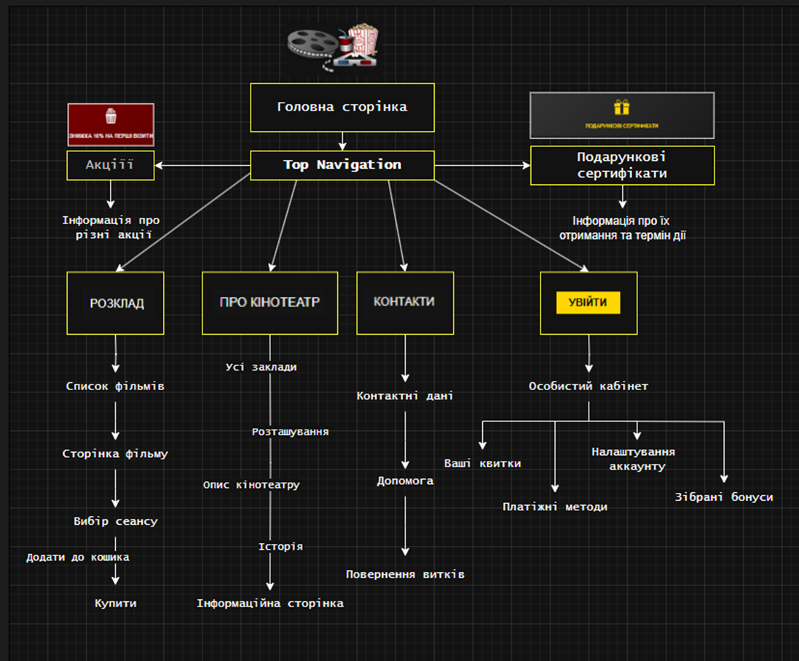

# Технічне завдання (ТЗ)

**Проєкт:** Вебсайт кінотеатру **CinemaVerse**  
**Мета роботи:** Розробити вебсайт для продажу квитків та бронювання місць, з адаптивним інтерфейсом для браузерів і мобільних пристроїв.  
**Підхід:** Agile (Scrum), орієнтація на якість за ISO/IEC 25010.

---

## 1. Короткий опис продукту

**Ціль:** Забезпечити можливість онлайн-продажу квитків та бронювання місць на сеанси кінотеатру, показувати афішу, трейлери, інформацію про фільми й сеанси.  
**Користувачі:** Звичайні глядачі (покупці), працівники каси/адміністратори кінотеатру.  
**Проблема, яку вирішує:** Відсутність онлайн-ресурсу у кінотеатру; довгі черги, відсутність швидкого перегляду актуальних сеансів і купівлі квитків онлайн.

---

## 2. Найменування й область застосування

**Найменування:** Вебсайт «CinemaVerse» — сервіс для перегляду афіші, покупки квитків і бронювання місць.  
**Область застосування:** Використовується кіноклубами та локальними кінотеатрами (м. та районного рівня) для обслуговування глядачів через вебінтерфейс.

---

## 3. Підстава для розробки

Розробка проводиться в межах лабораторних робіт з дисципліни «Основи програмної інженерії». Документ створено з урахуванням:

* Agile Manifesto, Scrum Guide;  
* Стандартів ISO/IEC 25010 (модель якості програмного забезпечення).

---

## 4. Призначення розробки

**Функціональне призначення:**  

* Показ афіші та розкладу сеансів;  
* Продаже/бронювання квитків онлайн з місцями;  
* Перегляд інформації про фільми (трейлери, опис, актори);  
* Особистий кабінет користувача (історія покупок, квитки);  
* Адмін-панель для управління сеансами, фільмами та продажем.  

**Експлуатаційне призначення:**  
Вебдодаток з доступом через сучасні браузери (десктоп/мобіль). Має адаптивний дизайн для smartphones/tablets/desktop.

---

## 5. Технічні вимоги

### 5.1. Технологічний стек (вимога від замовника)

* Frontend: **React**, **react-router**, **Vite**, **TailwindCSS**, CSS.  
* Backend: легкий Node.js- або серверний шар (в ТЗ вказано тільки стек фронтенду й БД; при реалізації передбачити API).  
* База даних: **SQLite** (MVP / студентський проєкт).  
* Формат розгортання: статичний фронтенд + API; проект повинен працювати локально та на мінімальному хостингу (Netlify / Vercel / VPS).  
* Репозиторій: GitHub (кожен студент розміщує свій репо).

### 5.2. Архітектура системи (модулі)

* Модуль автентифікації/авторизації (облікові записи, JWT).  
* Модуль каталогу фільмів (опис, трейлер, жанр).  
* Модуль розкладу сеансів (зали, місця, дата/час).  
* Модуль бронювання місць і оплати (інтеграція платіжного шлюзу).  
* Модуль квитків (генерація QR/PDF квитка).  
* Модуль адміністратора (управління фільмами, сеансами, звітами).  
* API-інтерфейс для інтеграції (REST).

### 5.3. Функціональні вимоги (коротка таблиця)

|   № | Функція           | Опис                                                  |
| --: | ----------------- | ----------------------------------------------------- |
|  F1 | Огляд афіші       | Список фільмів з постером, описом, трейлером          |
|  F2 | Пошук/фільтрація  | Пошук по назві, жанру, даті                           |
|  F3 | Перегляд сеансів  | Сеанси по даті/залі з доступними місцями              |
|  F4 | Бронювання місця  | Вибір місця(ць) у залі, тимчасове резервування        |
|  F5 | Оплата квитків    | Інтеграція з платіжним шлюзом, оплата картами         |
|  F6 | Генерація квитка  | Квиток (QR або PDF) після оплати                      |
|  F7 | Особистий кабінет | Історія покупок, друк квитків, повернення (опц.)      |
|  F8 | Адмін-панель      | CRUD для фільмів, сеансів, перегляд статистики        |
|  F9 | Повідомлення      | Email / SMS / push-повідомлення (опц.) про бронювання |
| F10 | Відгуки/рейтинги  | Користувачі можуть залишати відгуки (опц.)            |

> Примітка: обов’язкові для MVP — F1, F3, F4, F5, F6, F8, F7 (базовий).

### 5.4. Нефункціональні вимоги (ISO/IEC 25010 — вибрані атрибути)

Користувач вибрав головні атрибути якості: **1 (надійність), 2 (зручність інтерфейсу), 3 (продуктивність), 5 (сумісність)**. Нижче конкретика.

#### Надійність (Reliability)

* Відновлення після збоїв: після краху сторінки користувач має мати можливість відновити незавершене бронювання (сесія зберігається у БД тимчасово 10 хв).  
* Точність транзакцій: жодне квитування/оплата не фіксується без підтвердження від платіжного шлюзу.  
* Тестовий показник: 99% успішних транзакцій тестового середовища під навантаженням 50 concurrent користувачів (для студентського MVP — орієнтир).

#### Зручність інтерфейсу (Usability)

* Інтерфейс повинен бути інтуїтивним: процес покупки — не більше 3 кліків від вибору сеансу до оплати.  
* Адаптивність: перевірка на ширинах 360px, 768px, 1280px.  
* Доступність: базова підтримка семантичної розмітки, alt для зображень.

#### Продуктивність (Performance Efficiency)

* Час завантаження головної сторінки ≤ 2 с (в локальному/тестовому середовищі).  
* Відгук UI при виборі місця ≤ 200 ms.  
* Використання SQLite дозволяє працювати на MVP; під час масштабування — міграція на PostgreSQL.

#### Сумісність (Compatibility)

* Підтримувані браузери: Chrome (остання версія - 2 мин), Firefox (остання - 2 мин), Edge; мобільні версії Chrome/Firefox.  
* Адаптація під мобільні пристрої (responsive).  
* Експорт звітів у PDF/CSV.

> **Додатково (безпека)**: навіть якщо безпека не була обрана у топі, система повинна забезпечувати базові заходи: HTTPS, CSRF/XSS захист на стороні API, шифрування чутливих даних (паролі — bcrypt), безпечне зберігання токенів.

### 5.5. Умови експлуатації

* ОС: будь-яка, що підтримує сучасний браузер (Windows 10+, Linux, macOS).  
* Браузери: Chrome, Firefox, Edge (останні стабільні версії).  
* Підключення: для покупки — рекомендується канал ≥ 1.5 Mbps.

### 5.6. Вимоги до технічних засобів (MVP)

* Мінімум: 2 ядра CPU, 2 GB RAM, 20 GB диску (локально для розробки).  
* Рекомендовано: 4 ядра, 8 GB RAM для тестування з навантаженням.

---

## 6. Техніко-економічні показники (орієнтири)

* Оцінка часу на MVP (команда 2–3 студенти): ~8–10 тижнів (4 спринти по 2 тижні).  
* Вартість (симуляція): для звітності зазначити умовну собівартість = ___ USD (ставку можна заповнити за вимогою викладача).

---

## 7. Стадії та етапи розробки (Agile Scrum)

**Кількість спринтів:** 4 (по 2 тижні).

**Приклад плану:**

* **Спринт 1 (2 тижні)** — Аналіз вимог, UX/UI прототип, макети (F1, F2). Підготовка репозиторію, CI, Vite scaffold.  
  *Завдання:* створити сторінку афіші, компонент фільму, макети моб/десктоп.

* **Спринт 2 (2 тижні)** — Реалізація розкладу сеансів і вибору місць (F3, F4). Базова база даних (SQLite), API endpoints для сеансів.  
  *Завдання:* створити сторінку сеансу, креслення залу, логіку тимчасового резервування.

* **Спринт 3 (2 тижні)** — Інтеграція оплати та генерації квитка (F5, F6). Особистий кабінет користувача (F7).  
  *Завдання:* підключити тестовий платіжний шлюз (sandbox), генерувати QR/PDF.

* **Спринт 4 (2 тижні)** — Адмін-панель, тестування, виправлення багів, підготовка релізу MVP.  
  *Завдання:* UI-Polish, документація, інструкції для розгортання.

---

## 8. Порядок тестування та приймання

### 8.1. Типи тестування

* **Функціональне тестування (ручне)** — сценарії покупки/бронювання. (Користувач вказав ручне тестування.)  
* **Unit-тести** (опціонально; для компонентів React — Jest).  
* **Integration-тести** (перевірка API-ендоінтів вручну або через Postman).  
* **UI-тести** (Playwright / вручну для критичних шляхів).  
* **Користувацьке тестування** — група тестувальників (різні пристрої).

### 8.2. Критерії приймання (must)

ПЗ вважається прийнятим, якщо:

1. Всі критичні функції (купівля, бронювання, оплата в sandbox) працюють коректно.  
2. Дані про транзакції зберігаються в БД, квиток генерується і містить унікальний маркер (QR).  
3. Інтерфейс коректно відображається на мобільних і десктопних ширинах (360/768/1280).  
4. Усі баги критичного рівня (blocker/major) виправлені.  
5. Проєкт завантажений у GitHub з README і інструкцією по запуску.

---

## Діаграми

### Use Case

### ER-діаграма

---

## Відповіді на контрольні запитання

1. **Що таке технічне завдання і яку роль відіграє у розробці ПЗ?**  
   ТЗ — документ з вимогами до ПЗ (функціонал, архітектура, якість). Роль: основа для розробки, уникнення непорозумінь, визначення обсягу, бюджету, термінів, тестування.

2. **Які основні розділи ТЗ згідно стандартів?**  
   Опис продукту, найменування, підстава розробки, призначення, технічні вимоги, умови експлуатації, стадії розробки, тестування, додатки.

3. **У чому відмінність між функціональними та нефункціональними вимогами?**  
   Функціональні: що система робить (наприклад, бронювання). Нефункціональні: як працює (надійність, продуктивність, зручність).

4. **Які переваги Agile/Scrum у створенні ТЗ?**  
   Гнучкість, ітеративні зміни, фокус на цінності, швидке виявлення проблем, адаптація до змін.

5. **Які інструменти використані для документування та діаграм?**  
   Markdown для тексту/таблиць. HTML/SVG для Use Case та ER-діаграм (вбудовані в MD для GitHub).

6. **Як забезпечується надійність і відновлення даних у CinemaVerse?**  
   Відновлення сесій (збереження в БД на 10 хв), точні транзакції (підтвердження шлюзу), 99% успішність під навантаженням, базова безпека (HTTPS, bcrypt).

7. **Які критерії приймання визначені і як відбувається тестування?**  
   Критерії: робота функцій, збереження даних, адаптивність, виправлення багів, GitHub з інструкцією. Тестування: ручне функціональне, unit (Jest), integration (Postman), UI (Playwright), користувацьке.
